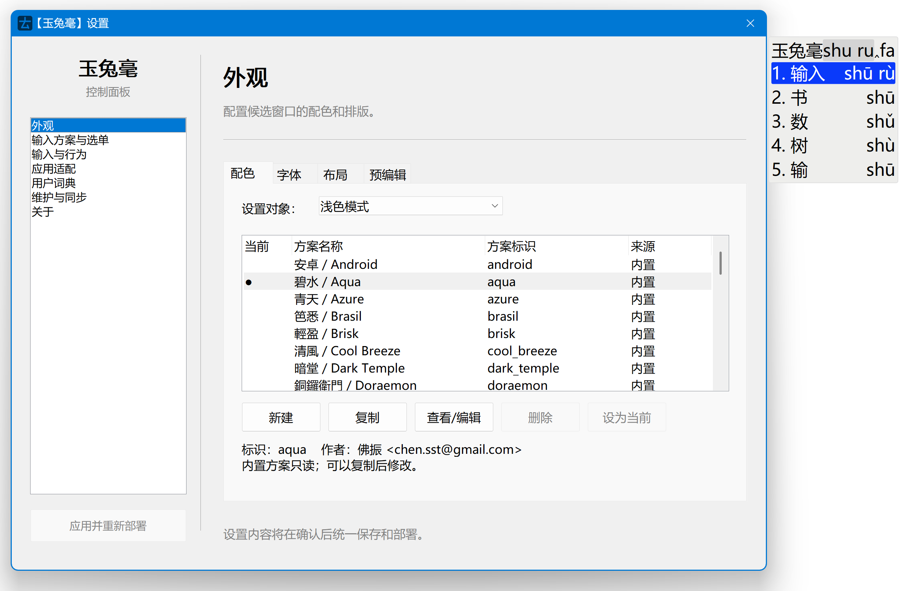

# 设置窗口

右键通知区域中的玉兔毫图标，选择“输入法设定”即可打开控制面板。设置窗口中的改动先保存在当前编辑状态，
点击“应用并重新部署”后才会写入 Rime 用户配置并使需要部署的改动生效。

设置窗口左侧用于切换页面，右侧显示当前页面的设置，底部按钮用于保存并重新部署：

## 首次安装

首次运行时，设置窗口会先打开“输入方案与选单”页面：

1. 在方案列表中勾选至少一个输入方案；
2. 按需要调整方案顺序；
3. 点击“完成安装并部署”。

首次部署完成后，其他设置页面会解锁。关闭窗口时如果还有未保存的改动，玉兔毫会询问保存、放弃或继续编辑。

## 页面概览

| 页面 | 用途 |
| --- | --- |
| 外观 | 配色、字体、候选窗布局、边距、圆角、阴影和预编辑 |
| 输入方案与选单 | 启用方案、调整顺序、设置方案选单和安装更多方案 |
| 输入与行为 | 输入状态、剪贴板上屏、候选翻页、切换键和按键绑定 |
| 应用适配 | 按目标程序设置默认中文或英文状态 |
| 用户词典 | 备份、恢复、导入和导出用户词典 |
| 维护与同步 | 重新部署配置，或同步用户资料 |
| 关于 | 查看版本、许可证和依赖项目 |

## 输入方案与选单

### 输入方案

方案列表中的勾选状态决定哪些方案会出现在 Rime 方案选单中。选中已启用的方案后，可以用“上移”和“下移”
调整选单顺序。启用“启动时始终使用第一个方案”后，玉兔毫每次启动都会选择列表中的第一个已启用方案；关闭时
则恢复上次使用的方案。

### 方案选单

“方案选单”页面可以设置：

- 选单标题；
- 一个或多个打开方案选单的快捷键，多个快捷键用逗号分隔；
- 是否折叠状态选项，以及是否显示状态缩写；
- 状态列表的前缀、分隔符和后缀；
- 哪些方案选项需要记忆。

方案选项由输入方案的 `switches` 声明。若某个选项没有出现在自动发现的列表中，可以添加自定义选项标识；标识
不能包含空白或斜线。方案开关的写法见[方案开关](../scheme/switches.md)。

### 获取更多方案

“获取更多方案”页面由 RimeDepot 提供方案安装。网络受限时，可以在该页面配置 RPPI 索引地址和代理；也可以选择
使用 Git，并指定 Git 可执行文件路径。安装前确认当前用户目录有写入权限。

## 输入与行为

“常规”页面包含以下设置：

- 输入状态提示及显示时长；
- 暂停或恢复玉兔毫的快捷键；
- 从不、始终或达到长度阈值时使用剪贴板上屏；
- 是否在所有程序之间共享中西文状态；
- 是否在组字过程中固定候选窗位置；
- 是否使用旧版候选窗；
- 是否在密码输入框中绕过 Rime；
- 各个中西文切换键的动作，以及 Caps Lock 的系统行为；
- 每页候选数和候选序号格式。

“按键绑定”页面可以新增、编辑、删除和调整 Rime 按键绑定。每条规则由接收按键、生效条件和动作组成；如果只
想调整玉兔毫的中西文切换键，应优先使用“常规”页面的切换键设置。

## 应用适配

应用规则使用目标程序的进程文件名，例如 `code.exe`，而不是窗口标题或快捷方式名称。添加或更新规则后选择
默认输入状态“中文”或“英文”，再点击“添加或更新”。选中规则后可以“恢复默认或移除”。

启用“在所有程序之间共享中西文状态”后，应用适配规则不会再单独决定各程序的默认状态；需要按程序分别设置时，
请关闭该选项。

## 用户词典与维护

用户词典的迁移、文本码表导入导出和同步方式见[用户词典与同步](dictionary-and-sync.md)。修改配置文件后的部署范围和
用户目录位置见[配置与部署](configuration.md)及[文件与目录](files-and-directories.md)。
