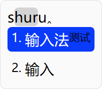
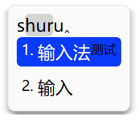
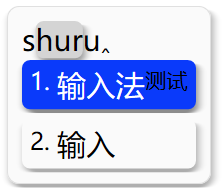

# 小狼毫式配色阴影支持计划

日期：2026-09-07。状态：代码与自动化验证已完成；多显示器、不同系统缩放及人工键鼠验收待补充。

下文保留原始设计计划；实际实现选择与验证记录见文末。

## 目标与范围

为现代候选窗增加可配置的柔和阴影，覆盖窗口、编码高亮块、高亮候选块和普通候选块。支持透明度、模糊半径和水平／垂直偏移，并使配色编辑、保存、预览和运行时切换形成完整闭环。默认关闭阴影，现有配置继续保持原有外观。

以小狼毫的字段名称与启用语义为兼容目标，不承诺不同渲染器之间逐像素一致。依据是小狼毫官方 [Weasel 定制化文档](https://github.com/rime/weasel/wiki/Weasel-%E5%AE%9A%E5%88%B6%E5%8C%96)：半径为零时关闭阴影，非零半径仍需配合非透明阴影色；偏移控制阴影位置。实现前补充固定版本的上游绘制代码对照，确认模糊范围及色块遮挡细节。

新增功能只面向现代候选窗。独立悬浮编码窗纳入编码阴影适配，避免开启悬浮编码后效果丢失；状态提示窗本期不扩展。旧版候选窗只做兼容回归。

## 当前基础

- 仓库源配置 `schemas/rabbit.yaml` 已列出四个阴影颜色字段，发布包中的对应配置文件是 `Data/rabbit.yaml`；四个字段均默认透明，但没有阴影半径和偏移配置。
- `RabbitUIStyleSnapshot.ahk` 尚未将阴影纳入受支持的样式快照；`RabbitColorScheme.ahk` 能通用读取、复制颜色字段，但编辑字段列表没有阴影。
- `RabbitCandidateBox.ahk` 使用 WIC 离屏绘制，再通过 `RabbitLayeredWindow.ahk` 更新分层窗口；窗口尺寸、显示位置和流式展开动画目前围绕主体尺寸工作。
- 设置中的 `RabbitAppearancePreview.ahk` 复用真实候选窗；`RabbitCandidatePreview.ahk` 另有独立绘制代码，需检查其调用方并同步仍在使用的预览入口。
- `RabbitDirect2D.ahk` 是应用扩展层，`Lib/Direct2D` 是 Rabbit 维护的第三方副本。不能直接假定当前 WIC render target 支持 Direct2D effects，也不应为此更新无关子模块。

## 配置契约

| 位置 | 字段 | 默认值 | 语义 |
| --- | --- | --- | --- |
| `style/layout` | `shadow_radius` | `0` | 非负整数；零关闭全部阴影 |
| `style/layout` | `shadow_offset_x` | `0` | 有符号整数，正值向右 |
| `style/layout` | `shadow_offset_y` | `0` | 有符号整数，正值向下 |
| `preset_color_schemes/<id>` | `shadow_color` | `0x00000000` | 窗口主体阴影 |
| 同上 | `hilited_shadow_color` | `0x00000000` | 编码高亮背景块阴影 |
| 同上 | `hilited_candidate_shadow_color` | `0x00000000` | 高亮候选背景块阴影 |
| 同上 | `candidate_shadow_color` | `0x00000000` | 普通候选背景块阴影 |

几何参数沿用布局配置路径，阴影色归属配色方案；本期不增加方案内布局覆盖这一新机制。尺寸遵循现有布局的 DPI 换算，保证只缩放一次。缺失或非法字段退回默认值，负半径无效，但负偏移有效；设置界面应明确报错。实现时确定统一的合理上限，避免超大配置导致位图分配失控，读取、编辑和渲染保护使用相同约束。

颜色沿用现有 `color_format` 转换。四种阴影色独立默认透明，不能因缺省字段继承其他色而意外启用。特别检查 `0x00000000` 经 Rime 读取、配色模型和 YAML 保存后仍为透明；现有整数颜色解析存在为短颜色补充 alpha 的逻辑，不能丢失八位颜色的透明语义。

使用示例（合并至配置对应节点，不替换其他配置）：

```yaml
style:
  layout:
    shadow_radius: 8
    shadow_offset_x: 2
    shadow_offset_y: 3
preset_color_schemes:
  custom_shadow:
    name: 阴影示例
    color_format: argb
    shadow_color: 0x50000000
    hilited_shadow_color: 0x00000000
    hilited_candidate_shadow_color: 0x30000000
    candidate_shadow_color: 0x00000000
```

## 绘制与坐标设计

### 阴影资源

先做可独立验证的圆角矩形阴影原型：对形状 alpha 蒙版做模糊，再按指定颜色与透明度着色，以预乘 alpha 合成进现有 WIC 管线。零偏移形成四周阴影，有偏移形成投影。圆角沿用对应背景块的实际半径；阴影是否启用只由半径和阴影色决定，不由背景色透明度代替判断。

原型阶段比较可在当前管线上使用的原生模糊路径与缓存蒙版方案，确认支持的 Windows 环境、x86/x64 调用及耗时后选定实现。避免每帧在 AHK 中逐像素执行大范围模糊；不以堆叠实心边框代替柔和阴影。若需要设备上下文才能使用 effects，先评估成本，不把渲染器整体迁移作为隐含前提。

拟新增 `RabbitShadowRenderer.ahk`，集中管理蒙版、模糊与缓存；必要的底层位图接口放在绘制封装中。缓存键包括尺寸、圆角、模糊参数和 DPI；若缓存着色结果还需包括颜色。设置容量或内存上限，样式／DPI 变化及 Dispose 时正确失效和释放。分配失败应记录可观察错误并退回无阴影绘制。

### 主体与绘制边界分离

保留现有主体布局坐标，不把阴影留白混入 margin、候选间距、文字测量、换行或最小尺寸。另行计算覆盖所有启用阴影的绘制边界，得到四边外扩量及主体在位图中的原点。

外扩量由实际模糊核支持范围和偏移计算，不能直接假定等于 `shadow_radius`。窗口阴影和可能越过主体边缘的编码／候选阴影均参与边界并集。所有阴影关闭时外扩严格为零。

窗口定位仍以主体相对光标的位置为基准，再换算位图窗口原点。检查 `RabbitPopupPlacement.ahk` 及其调用链的边界契约，优先保证主体在工作区可见；工作区容不下完整阴影时允许裁剪阴影，不能额外挤压内容。鼠标坐标先减去主体原点再进入原有候选命中逻辑，阴影区域不得选择候选或成为新的拖动区域，并验证能否将仅阴影区域的鼠标事件透传给下层窗口。

流式展开／收起需要同步调整 `RenderFrame`、`RenderPreviousFrame`、源位图裁剪和底部锚定计算。每帧阴影跟随可见主体边界，不能简单裁掉最终大窗口的阴影，造成硬切边、残影或位置跳动。

### 合成顺序

先绘制窗口阴影，再绘制主体背景和边框；然后绘制内部色块阴影、色块背景，最后绘制文字。内部阴影采用明确的分层顺序，避免后一候选的阴影盖住前一候选文字。实现前用相邻候选、半透明背景、零间距和大圆角样例确认遮挡规则。编码高亮阴影跟随实际高亮背景几何，不给整段普通编码擅自新增颜色字段。

悬浮编码窗复用同一阴影资源与边界计算，明确窗口整体 opacity 对阴影的共同作用。预览和真实窗口必须复用同一几何与模糊规则。

## 实施顺序

1. **配置与模型**：扩展 `RabbitUIStyleSnapshot.ahk` 的默认值、配置读取、方案应用和复制路径；扩展 `RabbitUIStyleSettings.ahk` 的布局持久化及 `RabbitColorScheme.ahk` 的编辑颜色列表。先完成透明值和保存往返回归。
2. **绘制原型**：实现可缓存的圆角阴影及边界计算，验证 alpha、DPI、正负偏移、性能和资源释放；记录最终算法与小狼毫的已知视觉差异。
3. **现代候选窗接入**：连接四类阴影，处理主体原点、窗口定位、点击命中和展开动画，再适配 `RabbitFloatingPreedit.ahk`。
4. **设置与预览**：在外观布局设置中增加半径和两个可输入负值的偏移控件；在 `RabbitColorSchemeDialog.ahk` 中增加四种阴影颜色，检查新增行后的尺寸和屏幕适配。支持实时预览、取消、保存、复制方案和明暗方案切换。
5. **文档与验收**：更新仓库源配置 `schemas/rabbit.yaml` 的字段说明和默认值（发布包对应 `Data/rabbit.yaml`），补充用户配置示例与效果截图。完成以下测试后再标记实现完成。

每个阶段保持可独立验证。新增实质性类各自建文件并声明直接依赖，不向入口脚本塞入阴影实现。

## 验证与完成标准

- 模型测试：扩展 `RabbitUIStyleSnapshotTest.ahk`、`RabbitColorSchemeTest.ahk`、`RabbitUIStyleSettingsTest.ahk`，覆盖缺省、非法值、负偏移、三种颜色格式、透明值、方案复制及保存重载。
- 几何测试：新增阴影边界测试，并扩展候选窗与定位测试，覆盖四方向偏移、关闭阴影零外扩、不同 DPI、超大参数和阴影区不命中候选。
- GUI 验证：运行 `RabbitCandidateBoxGuiTests.ahk`、`RabbitUIStylePreviewTests.ahk`、`RabbitColorSchemeDialogTests.ahk`；检查三种现代布局、候选切换、编码高亮、悬浮编码、流式展开收起、屏幕四边及不同缩放显示器。
- 视觉验收：四种阴影分别及同时启用；检查透明／半透明背景、亮暗背景、正负及零偏移、大圆角、相邻候选无文字遮挡，预览与实际效果一致。
- 性能验收：对比关闭与启用阴影时的连续输入、候选移动和展开动画耗时，记录位图重建次数及缓存内存。稳定尺寸重复绘制应复用资源，长时间切换尺寸后内存不能持续增长；默认关闭路径不增加阴影分配或模糊成本。
- 回归验收：现有无阴影布局基准保持不变；旧版候选窗正常运行。实施完成后启动 `Rabbit.ahk`，并运行 `Rabbit.ahk --deployer deploy` 验证部署路径，人工检查受影响的输入、配置和部署行为。

单元测试按仓库现有测试文件的方式使用 `RunTest`，集成测试独立执行，并准备匹配的 Rime DLL 与数据；启动和界面回归则按普通应用流程人工检查，不并入单元测试入口。

原计划阶段仅编写文档。实施阶段的结果记录如下。


## 实现记录

### 最终方案

- 已接入三个布局参数和四种阴影色，默认半径及颜色 alpha 均为零。半径范围为 `0–64`，偏移范围为 `-128–128`；与现有边框、圆角等布局值相同，采用渲染像素，不额外乘以字体的 DPI 缩放因子。
- `RabbitShadowRenderer.ahk` 使用 GDI+ 原生高斯模糊，将预乘 alpha 位图提交给现有 WIC／Direct2D 目标，无需迁移到 Direct2D effects。按形状尺寸、圆角、半径与颜色缓存，每个渲染器上限 32 项、16 MiB；配置变化、渲染目标变化和释放时清理资源。
- 模糊支持范围取半径，额外留一个像素容纳形状抗锯齿。参考 [Microsoft BlurParams](https://learn.microsoft.com/en-us/windows/win32/api/gdipluseffects/ns-gdipluseffects-blurparams) 与 [GDI+ bitmap flat API](https://learn.microsoft.com/en-us/windows/win32/gdiplus/-gdiplus-bitmap-flat)。兼容语义对照固定在 [Weasel 0.16.3 绘制代码](https://github.com/rime/weasel/blob/0.16.3/WeaselUI/WeaselPanel.cpp)。小狼毫在零偏移时会先绘制向外扩张的轮廓再模糊；Rabbit 统一模糊圆角矩形，因此零偏移阴影的扩散形态有所不同。Rabbit 也没有复刻小狼毫所有布局分支，不保证逐像素相同。
- 相对于原先扩大主体位图的设想，窗外阴影由 `RabbitShadowSurface.ahk` 的独立透明分层窗口承载。它位于主体之后，具有 `WS_EX_TRANSPARENT`，鼠标可穿透到其他进程。主体 HWND、布局尺寸、光标锚点及命中坐标保持原来的契约。窗口阴影使用圆角几何遮罩排除主体内部，候选与编码阴影在主体内外分别绘制，避免重复混合。
- 展开／收起时以当前可见高度生成窗外阴影，保留上一帧的样式和色块几何供收起使用；阴影随主体隐藏、样式切换和销毁。屏幕边界仍以主体定位，越出工作区的阴影可由桌面裁剪，不挤压内容。
- 悬浮编码复用同一阴影资源和外部窗口，并沿用整体 opacity。普通及高亮候选的阴影先于所有候选背景和文字绘制，不会覆盖相邻候选文字。
- 新设置页的真实预览直接使用现代候选窗；旧设置对话框的 `CandidatePreview` 改为现代绘制器的位图适配器，复用同一布局、阴影与遮罩，并按可用区域等比缩小位图以容纳流式或大字号布局。旧版候选窗没有新增阴影功能。
- 配色编辑器保持原窗口尺寸，用两列容纳 18 个颜色字段，并说明 alpha 和半径的启用条件。外观「排版」页增加半径及两个有符号偏移控件。
- 修正样式快照原有 RGBA 转 ARGB 的移位计算，使配置读取与配色编辑器一致；真实 librime 保存、部署和重载验证了八位透明色不会变成不透明色。

### 使用

在「外观 → 排版」设置非零阴影半径；在配色方案中编辑所需的阴影颜色。例如 `#50000000` 表示半透明黑色，`#00000000` 表示完全透明。颜色选择器保留 alpha，直接编辑前两位可调整透明度。半径设为零可统一关闭全部阴影。

以下为生产绘制器导出的透明 PNG，使用较大字号便于比较；在浅色页面上可清楚看到黑色阴影：

| 无阴影 | 窗口阴影 | 窗口与内部色块阴影 |
| --- | --- | --- |
|  |  |  |

可通过 `AutoHotkey64.exe /ErrorStdOut tests/integration/RabbitShadowRendererTests.ahk export` 重新生成示例。

### 验证记录

使用 AutoHotkey **2.0.19**：

- 单元测试入口 `tests/unit/RabbitTests.ahk`：216 项通过，包含样式解析、字段边界、四类颜色、明暗方案切换、保存路径及设置控件读取测试。
- `RabbitCandidateBoxGuiTests.ahk`：现代与旧版候选窗的现有 29 项回归通过。
- `RabbitShadowRendererTests.ahk`：x64 和 x86 原生模糊、预乘 alpha、缓存复用与容量限制、三种候选布局、外扩像素、窗口穿透标志、收起锚点、隐藏清理、悬浮编码和位图预览测试通过。
- `RabbitUIStylePreviewTests.ahk`、`RabbitColorSchemeDialogTests.ahk`、`RabbitDeployerDialogTests.ahk`：预览与对话框测试通过。
- `RabbitSettingsPersistenceTests.ahk`：在隔离的临时 Rime 数据目录中保存、部署、重载配色，验证透明色、负偏移和其他设置保留。
- 本机小窗口样例中，启用四类阴影后 30 次稳定帧约耗时 31–62 ms；窗外阴影缓存约 152–222 KiB，稳定帧不重新模糊。这是本机样例记录，不是所有机器和候选数量的性能保证。
- `Rabbit.ahk` 的普通模式与 `--deployer` 模式均完成启动路径验证；前端完成会话初始化并正常退出，部署器初始化了实际外观页和预览。

人工键鼠交互和设置页目视验收尚未完成；不同 Windows 版本、多显示器与系统缩放的实机矩阵亦未覆盖。已检查上方生产绘制器导出的图像，并以 GUI 测试验证新增控件位于原布局范围内。原型与测试未修改 caret-hook 安全配置。
