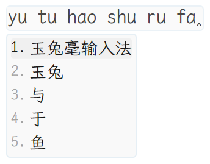
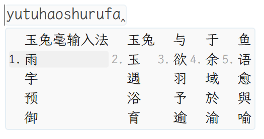
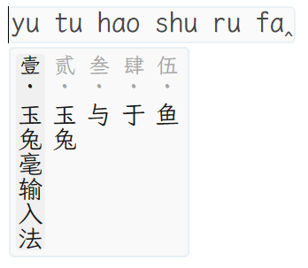
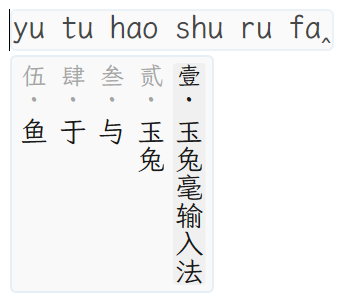

# 🐇️玉兔毫

由 [AutoHotkey](https://www.autohotkey.com/) 实现的 [Rime 输入法引擎](https://github.com/rime/librime)前端

[](https://github.com/rimeinn/rabbit/releases/latest)
[](https://github.com/rimeinn/rabbit/actions/workflows/ci.yaml)
[](https://t.me/rime_rabbit)
[](LICENSE)
[](https://github.com/rimeinn/rabbit/stargazers)

## 下载体验

> [!NOTE]
> 发现程序漏洞请在 [Issues](https://github.com/rimeinn/rabbit/issues/new/choose) 反馈。使用问题可以在 [Discussions](https://github.com/rimeinn/rabbit/discussions) 讨论，或者加入 [Telegram 群聊](https://t.me/rime_rabbit)。

玉兔毫可以直接解压运行，适合没有管理员权限的 Windows 环境。它不会要求安装系统输入法或写入系统范围的配置。若你拥有管理员权限，并且希望获得 Windows 上最完整、最成熟的 Rime 集成体验，建议优先选择[小狼毫](https://github.com/rime/weasel)。

### 通过发布页面下载

正式发行版会在 [Release](https://github.com/rimeinn/rabbit/releases) 页面的 Assets 中，下载最新的 `rabbit-v<版本号>.zip`，解压到一个新建文件夹，运行 `Rabbit.exe` 即可。

编译版提供 `rabbit-v<版本号>-compiled-x64.exe` 和 `rabbit-v<版本号>-compiled-x86.exe` 单文件下载，将 EXE 放进可写的独立文件夹后运行即可。编译版首次运行时，会向 EXE 所在目录释放资源文件。

每夜构建版可在 [`latest`](https://github.com/rimeinn/rabbit/releases/tag/latest) 页面下载。

### 通过 [scoop](https://scoop.sh/) 安装

```PowerShell
scoop bucket add siku https://github.com/amorphobia/siku
# 正式发行版
scoop install siku/rabbit
# 每夜构建版
scoop install siku/rabbit-nightly
```

## 界面预览

玉兔毫的现代候选窗提供三种布局，可以在 `rabbit.custom.yaml` 的 `style/layout/type` 中选择：

### 纵向堆叠（`stacked`）

默认布局。候选逐行显示，适合一般的拼音、注音和形码输入。



### 横向流式（`flow`）

候选按行横向排列，可以在较宽的屏幕上同时看到更多候选。候选超过一行时，玉兔毫会以多行分页显示，并在展开和收起时使用平滑过渡。




### 竖排文字（`vertical_text`）

候选文字从上到下排列，适合竖排文字输入。候选列可以设置为从左向右或从右向左排列，分别对应 `vertical_text_left_to_right` 的 `true` 和 `false`。





例如，使用横向流式可以配置为：

```yaml
style:
  layout:
    type: flow
```

现代候选窗和浮动预编辑框还可以通过 `style/preedit_type` 选择预编辑内容：`composition` 显示当前编码，
`preview` 显示高亮候选的提交预览；提交预览为空时会自动回退到当前编码。该设置也可以在“输入法设定”的
“外观 → 预编辑”页中修改。

## 脚本编译

本仓库提供*源码形式的玉兔毫脚本*以及*仅修改主图标的 AutoHotkey 可执行文件*，用户可根据需要自行编译为可执行文件以及压缩。编译方式可参照 AutoHotkey 的[官方文档](https://www.autohotkey.com/docs/v2/Scripts.htm#ahk2exe)。

编译单文件版本前，需准备好 `Data/`、图标和对应位宽的 `rime.dll`，并生成资源代码：

```powershell
pwsh -File .github/scripts/generate-compiled-resources.ps1 `
    -ManifestPath scripts/compiled-resource-manifest.json `
    -OutputPath Lib/RabbitCompiledResources.ahk `
    -RimeDllPath path/to/rime.dll -Architecture x64
```

资源清单仅维护在 `scripts/compiled-resource-manifest.json` 中；生成的 AHK 文件和同名 ZIP 不提交到仓库。
源码运行不需要生成文件，编译时则必须先生成。CI 会在准备资源和写入版本号之后自动执行生成步骤，
正式版和每夜构建的编译产物直接发布为 EXE；源码 ZIP 保留原来的发布方式。

## 目录结构

<details>
<summary>点击展开</summary>

> 以下描述的*可删除*、*编译后可删除*指的是删除后不影响使用，若要再次分发脚本或编译后的可执行文件，需遵守 [GPL-3.0 开源许可](LICENSE)。

```
rabbit/
├─ Data/                预设方案以及必要配置，内容删除后可能无法正常使用，若用户目录包含所有必要文件，可删除
├─ Lib/                 玉兔毫运行依赖脚本库，编译后可删除
|  ├─ librime-ahk       Rime 引擎的 AutoHotkey 绑定，编译后可删除
|  |  ├─ rime.dll       Rime 引擎的动态库，若本机已安装小狼毫，可删除；若没有安装小狼毫，需要 a. 保留在此，或 b. 放到主目录，或 c. 放到环境变量 "LIBRIME_LIB_DIR" 指定的目录
|  |  ├─ ...            librime-ahk 库的其他脚本，编译后可删除
|  ├─ RimeDepot         Rime 方案下载与安装库，编译后可删除
|  ├─ ...               其他依赖，编译后可删除
├─ plum/                若使用东风破，将被安装到此路径
├─ Rime/                Rime 用户文件夹，运行后会自动生成；可修改注册表 "HKEY_CURRENT_USER\Software\Rime\Rabbit" 中的 "RimeUserDir" 来指定不同的用户文件夹
├─ Docs/                文档资源，包含 README 使用的截图
|  └─ images/
|     └─ candidate-layouts/
├─ Locales/             多语言翻译，删除后回退到脚本内置的简体中文
├─ LICENSE              开源许可，可删除
├─ Rabbit.ahk           玉兔毫启动脚本（含部署器模式）
├─ Rabbit.exe           AutoHotkey 可执行文件，若本机已安装 AutoHotkey 或已编译，可删除
├─ README.md            本文件，可删除
├─ rime-install.bat     东风破批处理脚本，删除后无法从设定中调用东风破
```

</details>

## 使用的开源项目

- [librime](https://github.com/rime/librime)
- [librime-ahk](https://github.com/rimeinn/librime-ahk)
- [RimeDepot](https://github.com/rimeinn/RimeDepot)
- [AHK-Direct2D](https://github.com/rawbx/AHK-Direct2D)
- [OpenCC](https://github.com/BYVoid/OpenCC)
- [GetCaretPos](https://github.com/Descolada/AHK-v2-libraries)
- [GetCaretPosEx](https://github.com/Tebayaki/AutoHotkeyScripts/tree/main/lib/GetCaretPosEx)
- [东风破](https://github.com/rime/plum)
- [小狼毫](https://github.com/rime/weasel)

以及一些代码片段，在注释中注明了来源链接

## 问题反馈

如果遇到程序崩溃、输入异常、候选窗显示错误或其他问题，请在 [Issues](https://github.com/rimeinn/rabbit/issues/new/choose) 反馈。提交时请尽量说明：

- Windows 版本、玉兔毫版本以及使用的 Rime 方案；
- 出现问题的具体程序和可复现步骤；
- 使用的是哪种候选窗布局，提供 `rabbit.custom.yaml` 内容；
- 相关截图、错误信息或日志。

使用配置、方案或日常操作方面的问题，可以在 [Discussions](https://github.com/rimeinn/rabbit/discussions) 讨论，也欢迎加入 [Telegram 群聊](https://t.me/rime_rabbit)。

### 界面语言

支持简体中文、繁体中文（香港／台湾）、英文和日语，默认跟随系统语言。在控制面板的“输入与行为 → 界面”中选择语言，然后点击“应用并重新部署”即可生效。

也可以在 `rabbit.custom.yaml` 的 `patch` 下设置 `language`，可选值为 `auto`、`zh-CN`、`zh-HK`、`zh-TW`、`en-US` 或 `ja-JP`，修改后重新部署。

欢迎完善现有翻译或添加新语言，具体方法见 [翻译说明](Locales/README.md)。
